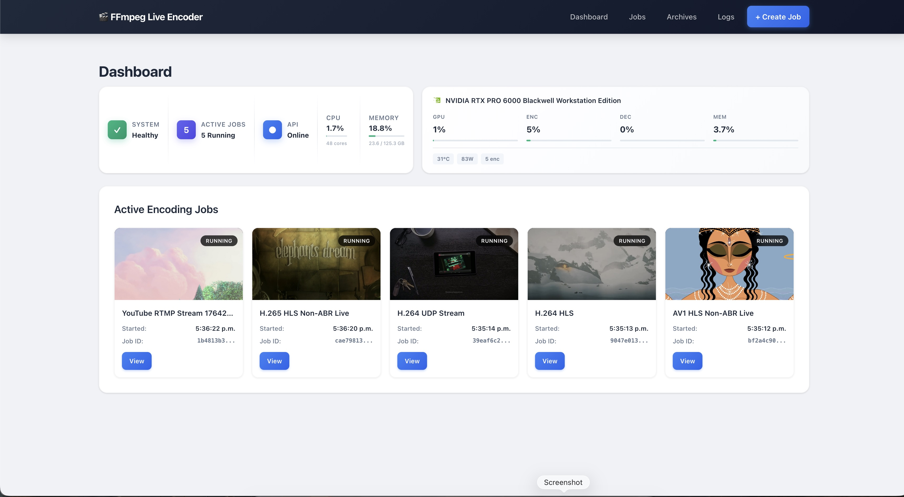
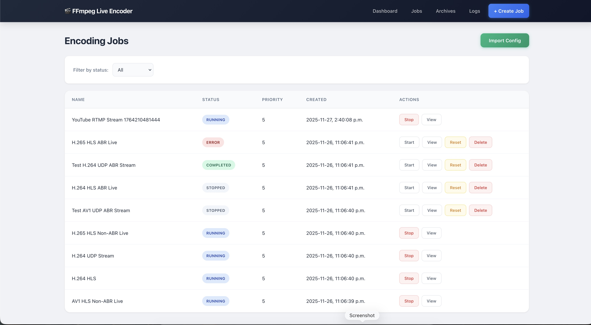
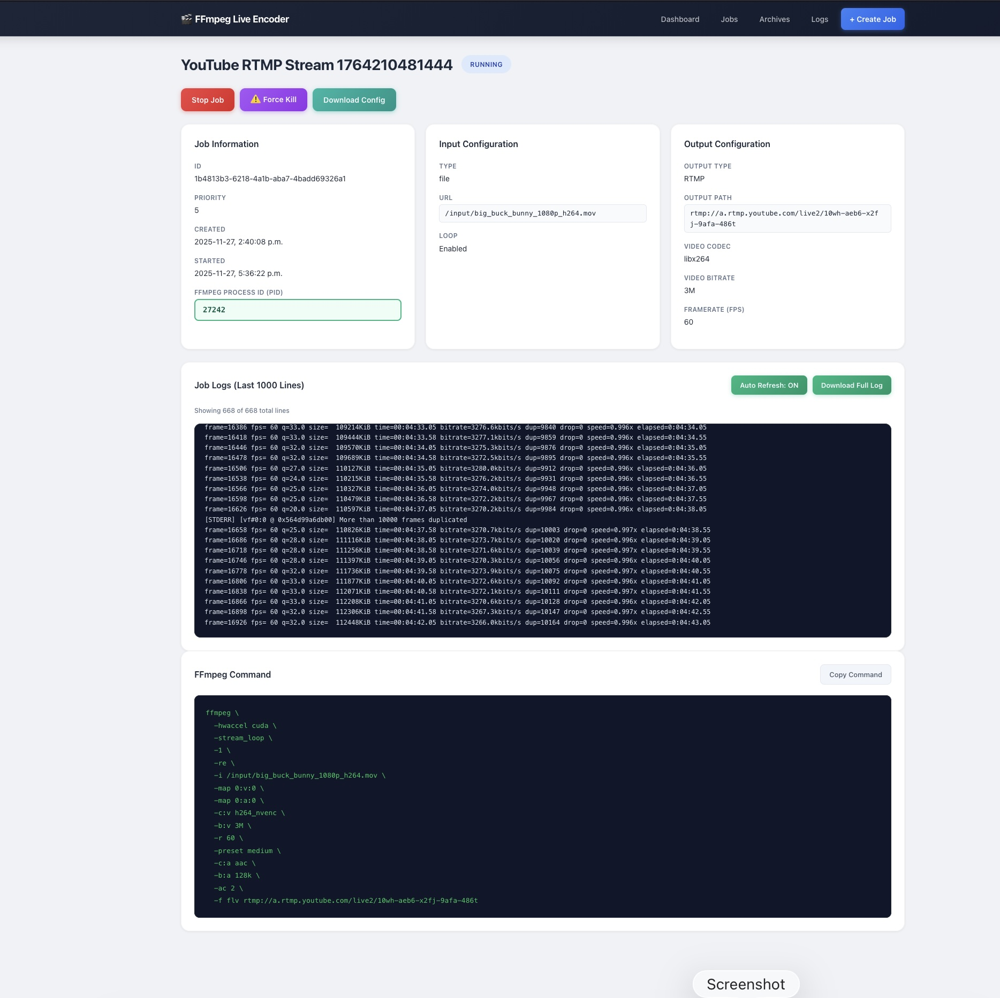
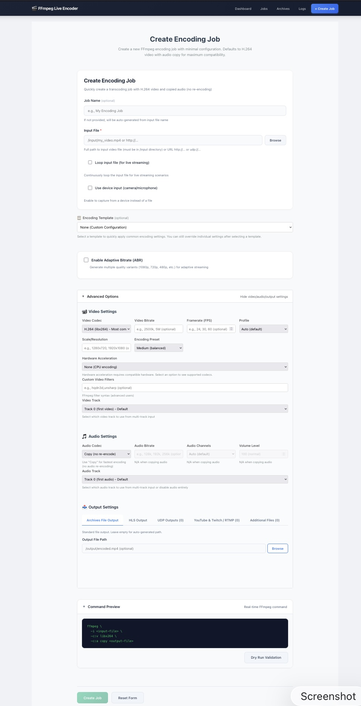

# FFmpeg Live Encoder

> **100% AI Assisted** - This entire project was built with AI assistance.

Open-source live video encoding solution featuring HLS streaming, multi-bitrate ABR ladders, real-time job monitoring via WebSocket, encoding presets, and a responsive web dashboard. Supports multiple output types including HLS, UDP, file archives, and direct streaming to YouTube and Twitch. Dockerized for easy deployment.

## Screenshots

### Dashboard


### Jobs List


### Job Details


### Create Job


## Features

- **HLS Streaming** - Generate HLS playlists with configurable segment duration
- **Multi-bitrate ABR** - Adaptive bitrate streaming with customizable quality ladders
- **Multiple Codecs** - Support for H.264, H.265/HEVC, and AV1 encoding
- **Real-time Monitoring** - WebSocket-based live job status and encoding progress
- **Encoding Presets** - Pre-configured encoding templates for common use cases
- **Input Analysis** - Automatic media file probing and track detection
- **Job Management** - Create, start, stop, and archive encoding jobs
- **Web Dashboard** - Modern responsive UI built with Svelte

## Technology Stack

| Component | Technology |
|-----------|------------|
| Backend | FastAPI (Python) |
| Frontend | Svelte |
| FFmpeg | [LinuxServer FFmpeg](https://github.com/linuxserver/docker-ffmpeg) (`lscr.io/linuxserver/ffmpeg:latest`) |
| Database | SQLite |
| Process Manager | s6-overlay |
| Web Server | Nginx |

### FFmpeg Image

This project uses the **LinuxServer FFmpeg** Docker image (`lscr.io/linuxserver/ffmpeg:latest`) as its base. This image provides:

- Full FFmpeg build with comprehensive codec support
- Hardware acceleration capabilities (NVENC, QSV, VAAPI)
- Regular updates and security patches
- s6-overlay process supervision
- Optimized for container deployment

## Quick Start

### Option 1: Docker (Recommended)

#### Prerequisites
- Docker and Docker Compose

#### Run the Application

```bash
docker-compose up -d
```

This starts all services in a single container.

### Option 2: Local Development (Without Docker)

#### Prerequisites
- Python 3.12+ ( Tested with Python 3.12)
- Node.js 20+
- FFmpeg installed locally

#### Backend Setup

```bash
cd backend

# Create virtual environment
python3 -m venv venv
source venv/bin/activate  # On Windows: venv\Scripts\activate

# Install dependencies
pip install -r requirements.txt

# Initialize database
python scripts/init_db.py

# Run the API server
PYTHONPATH=src uvicorn src.main:app --host 0.0.0.0 --port 8000 --reload
```

#### Frontend Setup

```bash
cd frontend

# Install dependencies
npm install

# Run development server
npm run dev
```

### Option 3: Use run_local.sh script

```bash
run ./run_local.sh
This script automatically:
Checks for required dependencies (FFmpeg, Python, Node.js)
Creates Python virtual environment
Installs backend and frontend dependencies
Builds the frontend
Initializes the database
Starts the backend server

#### Environment Variables (Local)

Create a `.env` file in the backend directory:

```env
INPUT_PATH=./input
OUTPUT_PATH=./output
DATA_PATH=./data
HLS_URL=http://localhost:8000/hls
```

### Access the Services

| Service | URL |
|---------|-----|
| Frontend | http://localhost:8001 |
| API | http://localhost:8000 |
| HLS Streaming | http://localhost/hls |
| WebSocket | ws://localhost:8000/ws |

## Configuration

Environment variables can be configured in `docker-compose.yml`:

| Variable | Default | Description |
|----------|---------|-------------|
| `API_PORT` | 8000 | API port |
| `HLS_URL` | http://localhost/hls | HLS streaming URL |
| `MAX_CONCURRENT_JOBS` | 10 | Max simultaneous encoding jobs |
| `DEFAULT_SEGMENT_DURATION` | 6 | HLS segment duration (seconds) |
| `AUTO_RESTART_JOBS_ON_BOOT` | false | Auto-restart jobs after container restart |

## Volumes

| Path | Description |
|------|-------------|
| `./data` | Database storage |
| `./output` | HLS output files |
| `./input` | Input media files (read-only) |
| `./logs` | Application logs |

## API Reference

Base URL: `http://localhost:8000/api/v1`

<details>
<summary><b>Jobs</b></summary>

| Method | Endpoint | Description |
|--------|----------|-------------|
| GET | `/jobs` | List all jobs |
| POST | `/jobs/create-unified` | Create a new encoding job |
| GET | `/jobs/{job_id}` | Get job details |
| POST | `/jobs/{job_id}/start` | Start a job |
| POST | `/jobs/{job_id}/stop` | Stop a job |
| DELETE | `/jobs/{job_id}` | Delete a job |
| GET | `/jobs/{job_id}/logs` | Get job logs |
| GET | `/jobs/browse/files` | Browse input files |
| POST | `/jobs/validate` | Validate job configuration |
| POST | `/jobs/metadata/probe` | Probe media file metadata |

</details>

<details>
<summary><b>Presets</b></summary>

| Method | Endpoint | Description |
|--------|----------|-------------|
| GET | `/presets` | List all presets |
| GET | `/presets/{preset_id}` | Get preset details |
| GET | `/presets/categories/list` | List preset categories |
| GET | `/presets/tags/list` | List preset tags |

</details>

<details>
<summary><b>Analysis</b></summary>

| Method | Endpoint | Description |
|--------|----------|-------------|
| POST | `/analysis/input` | Analyze input source |
| POST | `/analysis/validate-input` | Validate input source |

</details>

<details>
<summary><b>Archives</b></summary>

| Method | Endpoint | Description |
|--------|----------|-------------|
| GET | `/archives` | List archived jobs |
| GET | `/archives/{job_id}` | Get archived job details |
| POST | `/archives/{job_id}/restore` | Restore archived job |
| DELETE | `/archives/{job_id}` | Delete archived job |
| GET | `/archives/stats/summary` | Get archive statistics |

</details>

<details>
<summary><b>System</b></summary>

| Method | Endpoint | Description |
|--------|----------|-------------|
| GET | `/system/health` | Health check |
| GET | `/system/config` | Get system configuration |
| GET | `/system/info` | Get system information |
| GET | `/system/metrics` | Get real-time system metrics |

</details>

<details>
<summary><b>Logs</b></summary>

| Method | Endpoint | Description |
|--------|----------|-------------|
| GET | `/logs/container/stream` | Stream container logs |
| GET | `/logs/container/tail` | Get recent container logs |
| GET | `/logs/api/stream` | Stream API logs |
| GET | `/logs/api/tail` | Get recent API logs |

</details>

## License

MIT
